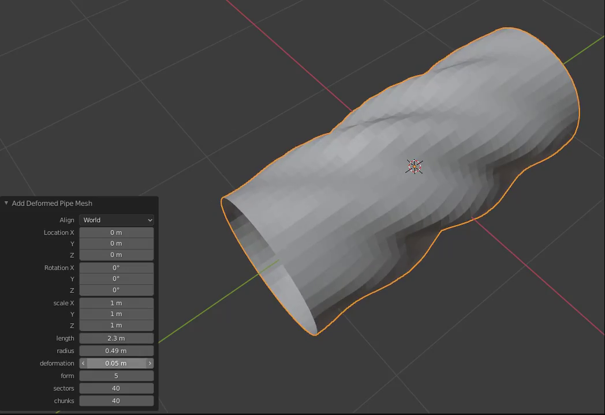

# Deformed Pipe plugin for Blender



## Description

This Blender plugin creates a 3D mesh of a deformed hollow pipe under linear pressure along the length of the pipe.

Equation of the deformed surface:

```
w(x,y)=w_0 \sin \frac{m \pi x}{l} \sin \frac{n y}{R};\quad \varphi_u(x,y)=\varphi^0_u \sin \frac{m \pi x}{l} \sin  \frac{n y}{R}
```
